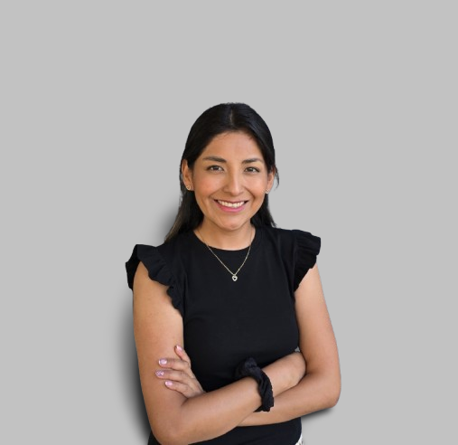
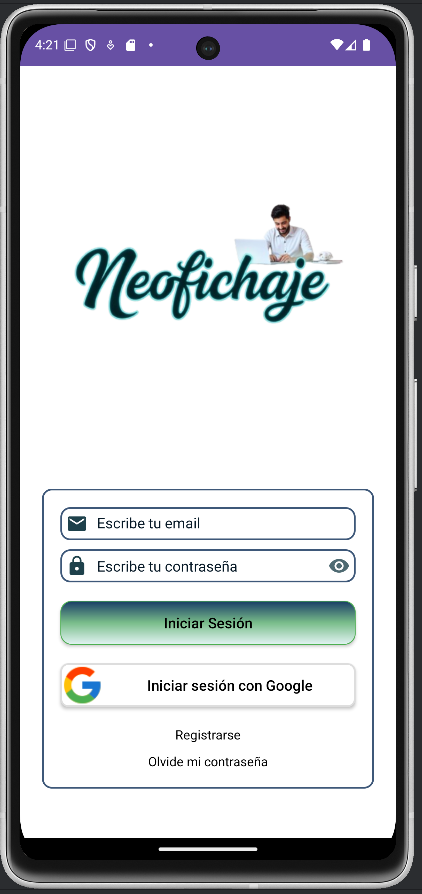

# Landing Page Personal de Karina Rojas

Este proyecto es una landing page personal que muestra mi perfil como desarrolladora Full Stack, incluyendo mis habilidades, formación, proyectos y datos de contacto. Fue desarrollado como ejercicio práctico para aplicar HTML, CSS y buenas prácticas de maquetación responsive.

## :desktop_computer: Tecnologías usadas

- HTML5
- CSS3
- Flexbox
- Media Queries
- Git y GitHub

## :dart: Objetivo del proyecto

- Mostrar mis proyectos y experiencia profesional de manera clara.
- Practicar diseño responsive y centrado de contenidos.
- Organizar los archivos en carpetas (`assets`, `pages`, `css`).
- Documentar correctamente el proyecto en un README.

## :file_folder: Secciones de la web

- `#presentacion` → Foto y presentación personal.
- `#sobreMi` → Formación, experiencia y habilidades.
- `#tecnologias` → Tecnologías y herramientas que manejo.
- `#proyectos` → Proyectos destacados: LiterAlura y NeoFichaje.
- `#contacto` → Datos de contacto y enlaces a GitHub/LinkedIn.

## :rocket: Funcionalidades implementadas

- Navegación interna por secciones con anclas.
- Botones CTA (Call to Action) para ir a proyectos o contacto.
- Visualización de proyectos con imágenes, descripciones y enlaces a GitHub.
- Diseño responsive para móviles y escritorio.
- Enlaces de descarga a mi CV.

## :camera_with_flash: Capturas de pantalla

  
*Sección de presentación personal*

  
*Proyecto LiterAlura*

  
*Proyecto NeoFichaje*

## :globe_with_meridians: Despliegue en GitHub Pages

Puedes ver el proyecto online haciendo [click aquí](https://github.com/KarinaRojasDev/landing_web)

## :books: Lecciones aprendidas

- Mejor manejo de etiquetas semánticas (`section`, `article`, `header`, `footer`).
- Flexbox y media queries para diseño responsive.
- Organización de archivos y recursos en carpetas (`assets`, `pages`, `css`).
- Implementación de enlaces y botones funcionales.
- Documentación de proyectos con README.md.

## :wrench: Siguientes pasos

- Añadir más proyectos y enlaces a repositorios.
- Mejorar la estética y animaciones ligeras con CSS.
- Añadir un formulario de contacto funcional.
- Optimizar imágenes para mejorar tiempos de carga.

## :bar_chart: Estado de avance

- Presentación personal: 100%
- Secciones de la web: 100%
- Proyectos y enlaces: 100%
- Diseño responsive: 70%
- Funcionalidades adicionales (formulario, animaciones): 0%

## :adult::computer: Autor

- Nombre: Karina Rojas
- LinkedIn: [https://www.linkedin.com/in/karina-paola-rojas-jorge-812289313/](https://www.linkedin.com/in/karina-paola-rojas-jorge-812289313/)
- GitHub: [https://github.com/KarinaRojasDev](https://github.com/KarinaRojasDev)
